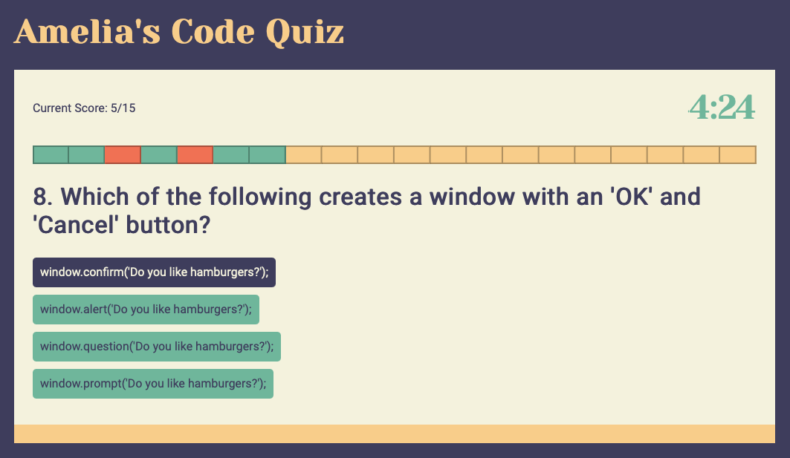

# Code Quiz
The project goal was to create a timed coding quiz. The user answers 20 multiple choice questions about HTML, CSS, and JavaScript. The score is updated on the page. Incorrect answers reduce the timer.

When the timer runs out or all questions have been answered, the user may input their name to save their score. The highscores are stored in the browser and are accessible after the browser has been closed.

The layout is mobile responsive.

The page can be found [here](https://amelia-was.github.io/code-quiz/)

## Built Using
- HTML
- CSS
- JavaScript
